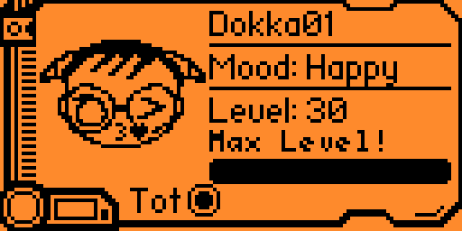
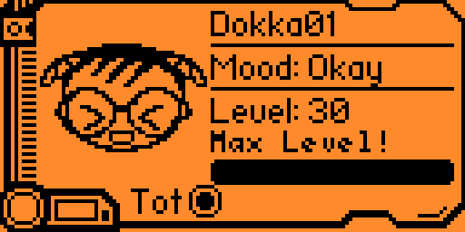
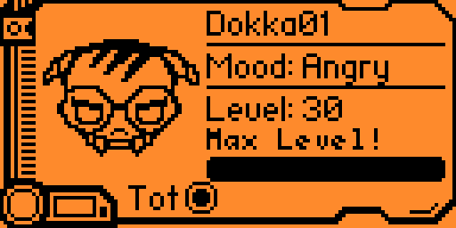
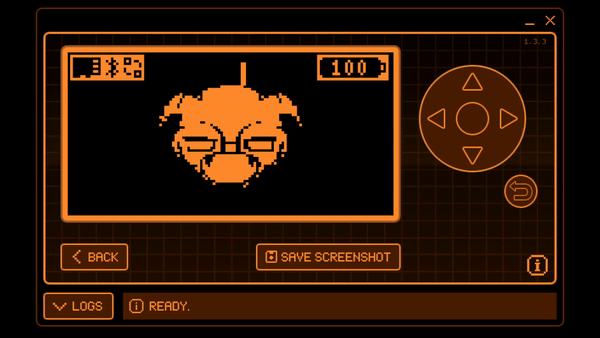

    <h1> Dokkaebi R6 asset pack </h1>

## ℹ️ Introduction

The operator **Dokkaebi** of the Competitive FPS **Rainbow Six Siege (R6)**, is a true technological genius, she has the special ability **Logic Bomb**. This ability allows Dokkaebi to hack into enemies' electronic devices, causing their phones to ring persistently. This ringing forces opposing operators to reveal their location by forcing them to answer their devices to stop the noise. Dokkaebi can also recover his victims' phones in order to hack enemy cameras on the defenders' side. 

- **R6 "Logic Bomb" hacking tool preview**:

- **Passport moods preview**:

- **Animation preview**:

This is a custom asset pack that I built for my Flipper Zero. The main theme is Dokkaebi's Logic Bomb hacking tool in R6. If you want to install the pack on your Flipper check the section [below](#-installation).

## 🐬 Firmwares support

*⚠️Note: the asset pack has been created primarly for Xtreme firmware. Maybe you can encounter some compatibility issue with an other firmware*

| Firmware | Animations | Icons |
| :--- | :---: | :---: |
| Official | ✅ | ❓ |
| Xtreme | ✅ | ✅ |
| Unleashed | ✅ | ❓ |
| RogueMaster | ✅ | ❓ |

- ✅ = tested and working
- ❌ = not supported
- ❓ = not tested

## 🚀 Installation

To install the asset pack, download the zipped pack on your computer, extract it and copy the directory on your Flipper's SD with the qFlipper App (follow the instructions for your firmware):
- **Official firmware**:
    1. Copy all the content of the directory `Dokkaebi Anim` (`manifest.txt`, and `DokkaebiCall_128x64`folder) from the asset pack, and add it to your Flipper at `SD Card/dolphin`
    2. Restart your Flipper
- **Xtreme firmware**:
    1. Copy the directory `Dokkaebi` from the asset pack, and add it to your Flipper at `SD Card/asset_packs`
    2. Open `Xtreme` > `Interface` > `Graphics` and select `Dokkaebi` in `Asset Pack`
- **RogueMaster firmware**:
    1. Copy all the files from `Dokkaebi Anim` inside the directory `SD Card/dolphin` of your Flipper
    2. Open `CFW Settings` > `Interface` > `Desktop` and select `Dokkaebi` in `Animations`
- **Unleashed firmware**:
    1. Copy the directory `Dokkaebi Anim` inside the directory `SD Card/dolphin` of your Flipper
    2. Restart your Flipper

**Note: you can also install single animations instead of all the asset pack but you need to update the Manifest file.**

## 🥇 Credits

Without the following people I wouldn't be able to made this pack... so shout out to them! 

- [Talking Sasquach - The Ultimate Guide to Flipper Zero Animations!!](https://www.youtube.com/watch?v=trpcZLlJtNw)
- [Talking Sasquach - "Flipper Zero Animation Process"](https://tinyurl.com/squach)

I used the readme.md of **MS-XIII** as a template for my own readme.md, so i link his work if you want to check. 

- [MS-XIII github](https://github.com/MS-XIII)
